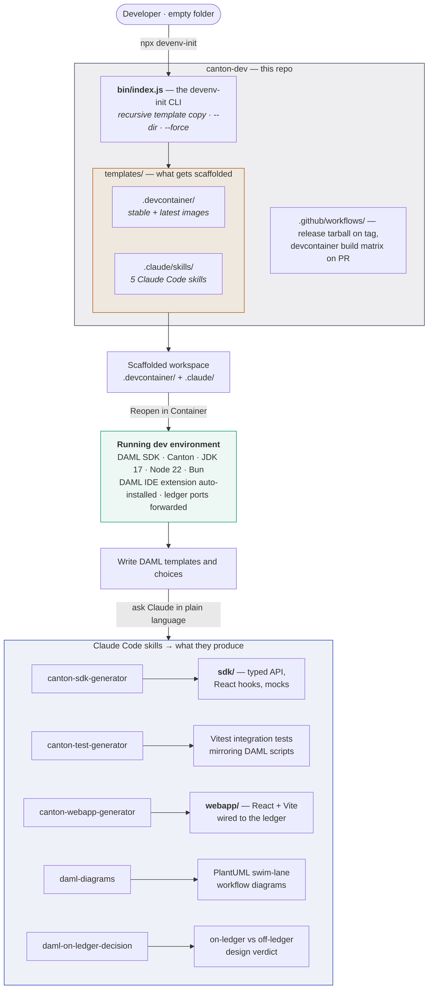
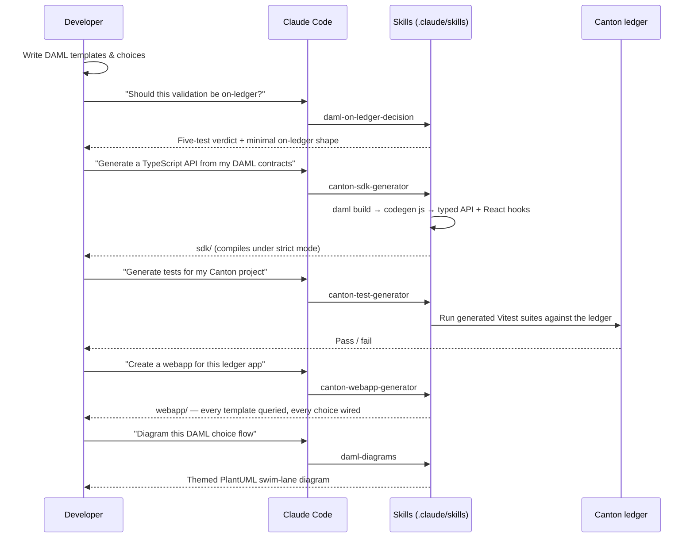

# canton-dev

Tooling that removes the setup tax from Canton/DAML development.

This repository ships **`canton-devenv-start`** — a zero-dependency Node CLI that scaffolds a
ready-to-use Canton + DAML workspace: a reproducible devcontainer with the DAML SDK and Canton
runtime pre-installed, plus a set of Claude Code skills that turn DAML contracts into a typed
TypeScript SDK, integration tests, a React webapp, and workflow diagrams.

One command, and you go from an empty folder to writing DAML instead of installing toolchains.

```bash
npx git+ssh://git@github.com/Moonsong-Labs/canton-dev.git#v1.0.0
```

---

## What this repo contains



### Repository layout

| Path | What it is |
|------|-----------|
| `packages/canton-devenv-start/bin/index.js` | The whole CLI. Recursive template copy, path-traversal guard, permission-preserving, skip-unless-`--force`. No runtime dependencies. |
| `packages/canton-devenv-start/templates/.devcontainer/` | Two devcontainer variants sharing a base image, plus IDE helper scripts. |
| `packages/canton-devenv-start/templates/.claude/skills/` | Five Claude Code skills copied into the generated workspace. |
| `.github/workflows/release.yml` | On a `v*` GitHub release: stamps the version, `npm pack`s, attaches the tarball to the release. |
| `.github/workflows/test-devcontainers.yml` | On PRs touching `.devcontainer/`: builds both image variants from the config declared in `devcontainer.json`. |

---

## Why it's useful

Setting up Canton/DAML by hand means picking an SDK version, installing the JVM, matching the DAML
Studio extension to the SDK, wiring the language server, and — on DAML 3.x — building DAML Finance
from source through `dpm`. That is a day of work per machine, and it drifts between teammates.

This repo collapses it into three things:

**1. A reproducible environment.** The devcontainer pins the SDK version as a build arg and fails the
build if it's missing, so "works on my machine" isn't a category of bug. Two variants are maintained
side by side, both verified in CI:

| Variant | DAML SDK | Extras |
|---------|----------|--------|
| `stable` | 2.10.2 | Shared base image: JDK 17, Node 22, Bun, TypeScript, Vitest |
| `latest` | 3.4.9 | Adds `dpm` CLI, `oras`, `yq`, and a pre-built DAML Finance (pinned commit) so the DARs are ready on first boot |

Both forward the Canton ledger, admin, and JSON API ports (`5011`, `5012`, `5018`, `5019`, `5021`,
`5022`, `7500`, `7575`), auto-install the bundled DAML VS Code extension on attach, and run as a
non-root `daml` user.

**2. The generated-code gap, closed.** `daml codegen js` emits deeply nested TypeScript keyed by
package hashes — technically complete, painful to write applications against. The
`canton-sdk-generator` skill parses those bindings into a flat, typed API: one namespace per
template with `Payload`, `create()`, and a function per choice, plus query helpers, type guards,
mock factories, retry/error classes, and a React layer (context, typed query and mutation hooks,
query-key factories for cache invalidation).

**3. Design and delivery help where the decisions are hard.** `daml-on-ledger-decision` encodes a
five-test framework for what actually belongs on a ledger — and defaults to *off*-ledger, which is
the answer most teams reach too late. `daml-diagrams` renders multi-party workflows as themed
PlantUML swim-lane diagrams, including the party-lane conventions and PlantUML routing workarounds
that otherwise take a few afternoons to discover.

---

## Getting started

```bash
# Scaffold into the current folder
npx git+ssh://git@github.com/Moonsong-Labs/canton-dev.git#v1.0.0

# Or into a specific folder, overwriting existing files
npx git+ssh://git@github.com/Moonsong-Labs/canton-dev.git#v1.0.0 --dir ./my-app --force
```

| Option | Description |
|--------|-------------|
| `--dir`, `--path <path>` | Output directory (defaults to the current directory) |
| `--force`, `-f` | Overwrite files that already exist |
| `--help`, `-h` | Show usage |

Then:

1. Open the folder in VS Code or Cursor.
2. **Reopen in Container** → choose `latest` (SDK 3.x) or `stable` (SDK 2.x).
3. Run `daml build` at the root to warm up the language server.
4. Ask Claude for what you need next — for example, *"Generate a TypeScript API from my DAML contracts"*.

### The typical loop



---

## The skills in detail

| Skill | What it does | Say something like |
|-------|--------------|--------------------|
| `canton-sdk-generator` | Discovers DAML projects, builds, runs `codegen js`, and generates a clean typed API + React hooks + Vitest scaffolding, then type-checks it. | *"Generate a TypeScript API from my DAML contracts"* |
| `canton-test-generator` | Reads `daml/Scripts/tests/`, replicates `Setup.daml` through the SDK, and writes TypeScript integration tests that mirror the DAML scripts. Requires the SDK first. | *"Generate tests for my Canton project"* |
| `canton-webapp-generator` | Scaffolds a React 18 + Vite + TanStack Query + Tailwind app, then wires a hook and UI for **every** template and **every** choice found in the SDK. No placeholders. | *"Create a webapp for this ledger app"* |
| `daml-diagrams` | Themed PlantUML activity diagrams for choice flows and multi-party workflows — swim lanes per party, with the routing pitfalls already handled. | *"Diagram this DAML choice flow"* |
| `daml-on-ledger-decision` | Walks the authority / audit / shared-input / atomicity / privacy tests and pushes toward the smallest possible on-ledger commitment. | *"Should this validation be a DAML choice or backend logic?"* |

Skills land in `.claude/skills/` in the generated workspace and are invoked from natural language —
there are no commands to memorize.

---

## Local development

```bash
cd packages/canton-devenv-start
bun link

# In a scratch workspace
bunx canton-devenv-start
```

The CLI is plain CommonJS with no dependencies, so `node bin/index.js --dir /tmp/scratch` works
directly for a quick check.

### Releasing

Create a GitHub release tagged `vX.Y.Z`. The release workflow stamps `X.Y.Z` into the package
version, runs `npm pack`, and attaches `devenv-<version>.tgz` to the release. Consumers install via
the `git+ssh` URL pinned to that tag.

### Changing the devcontainer

`test-devcontainers.yml` reads `DAML_SDK_VERSION`, `dockerfile`, and `context` straight out of each
`devcontainer.json` and builds both variants on every PR that touches `.devcontainer/`. Bump the SDK
in `devcontainer.json` — CI picks it up with no workflow edit.

---

## License

MIT — see `packages/canton-devenv-start/package.json`.
